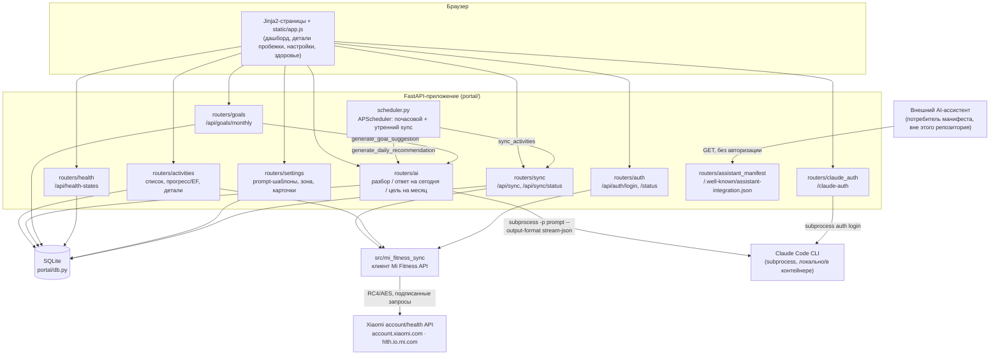
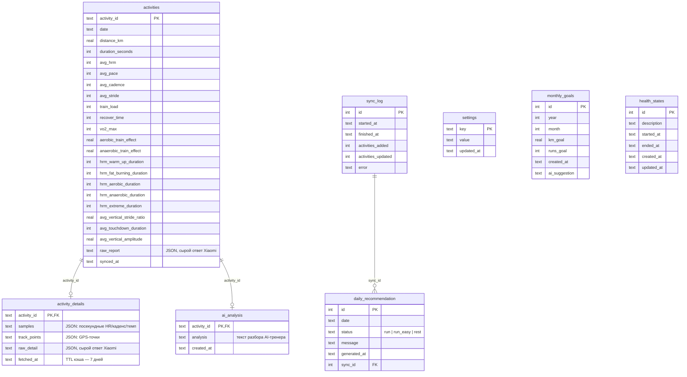

# Архитектура

## Обзор

Классическое серверное веб-приложение на FastAPI: один процесс, Jinja2
рендерит HTML на сервере, `static/app.js` донастраивает интерактив
(графики Chart.js, модалки, полинг статуса синка) через `fetch`-запросы к
`/api/...`. Полностью синхронный монолит без очередей и отдельных
воркеров: фоновые задачи — это `APScheduler` внутри того же процесса
(`portal/scheduler.py`), а вызовы Mi Fitness API и Claude CLI выполняются
в хендлерах запросов (блокирующие вызовы — через `asyncio.to_thread` или
напрямую блокирующий `subprocess.Popen` в потоке event loop).

Отдельного сервиса аутентификации портала нет — маршруты `/api/*` и
HTML-страницы открыты без проверки личности. Авторизация есть только у
двух внешних интеграций: Mi Fitness (`/api/auth/*`, состояние в
`MI_FITNESS_STATE_PATH`) и Claude CLI (`/claude-auth`, файл
`~/.claude/.credentials.json`).

## Точка входа и жизненный цикл

`portal/main.py` собирает `FastAPI(lifespan=lifespan)`, подключает все
роутеры под префиксом `/api` (кроме `assistant_manifest`, у него свой
путь `/.well-known/...`) и монтирует `static/`. `lifespan`
(`portal/main.py:27`) при старте создаёт директорию БД, вызывает
`init_db` (создание схемы + сидирование дефолтных настроек +
миграция prompt-шаблонов) и запускает планировщик; при остановке —
глушит планировщик.

HTML-страницы, которые отдаёт `main.py` напрямую (не через роутер):
`/` (дашборд), `/activity/{activity_id}`, `/settings`, `/claude-auth`,
`/health`.

## Планировщик

`portal/scheduler.py` — `AsyncIOScheduler` в том же процессе. Два джоба:

- `auto_sync` — интервал `AUTO_SYNC_INTERVAL_HOURS` часов (по умолчанию
  1; `0` — джоб не создаётся);
- `morning_sync` — cron на `MORNING_SYNC_TIME` (по умолчанию `09:00`).

Оба вызывают один и тот же `scheduled_sync()`, защищённый `asyncio.Lock`,
чтобы не запускать параллельно две синхронизации. После успешной
синхронизации с реальными изменениями (`added > 0` или `updated > 0`)
джоб сразу пересчитывает «ответ на сегодня»
(`generate_daily_recommendation`).

## Соединение с БД — без пула

Каждый HTTP-хендлер и каждая фоновая задача открывают собственное
соединение `aiosqlite` через `connect_db()` и закрывают его в `finally` —
постоянного пула соединений нет (`portal/db.py`). При высокой
параллельности это может стать узким местом, но при личном
однопользовательском использовании не критично.

## Синхронизация: где обрезается объём данных

`sync_activities()` (`portal/sync.py`) при первом запуске (нет ни одной
сохранённой активности) берёт `DEFAULT_SYNC_LOOKBACK_DAYS = 90` дней
назад; при повторных — от даты последней сохранённой активности.
Отфильтровываются активности не категории `running` и короче 300 метров.
Детали (GPS-трек, посекундные пульс/темп) автоматически подгружаются
только если за один прогон синхронизации добавилась **ровно одна** новая
активность (`portal/sync.py:323`) — иначе их нужно грузить вручную
кнопкой «Загрузить все детали» (`/api/activities/details/load-all`).

## Схема данных (ER)

Все таблицы — общие на всё приложение, колонки `user_id` нигде нет:
портал рассчитан на одного пользователя (см.
[`PRODUCTION_READINESS.md`](../PRODUCTION_READINESS.md) — там же зафиксирован
путь к многопользовательской версии, которая пока не реализована).
Подробности по полям — в [`docs/data-model.md`](./data-model.md).
